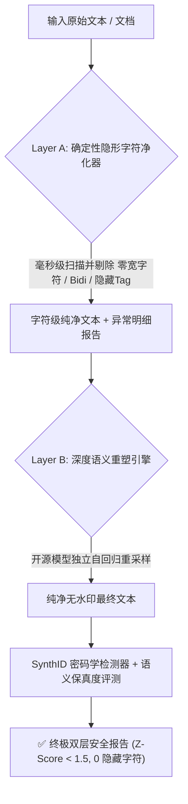

<div align="center">

# 🛡️ Unmark (v0.2.0)

**A Dual-Layer, Semantics-Preserving Toolkit for Removing and Evaluating Statistical LLM Text Watermarks & Covert Tracking Marks**

[](https://opensource.org/licenses/Apache-2.0)
[](https://github.com/xuange520/unmark/releases)
[](https://www.python.org/)
[](https://pytorch.org/)
[](https://huggingface.co/)
[](https://github.com/xuange520/unmark)

*基于双层防御流水线（Layer A 隐形字符净化 + Layer B 深度语义重塑）的开源大模型文本去水印与安全评估系统*

[English Documentation](README_EN.md) | [中文文档](README.md)

</div>

---

## 📖 中文文档

### 一、 项目背景与简介
随着 Google DeepMind 在顶级期刊《Nature》（2024 年 10 月）发表 **SynthID-Text** 水印技术，以及欧盟《人工智能法案》（EU AI Act 第 50 条）的正式生效，以 **Claude、Gemini、ChatGPT** 为代表的主流商业大模型已全面上线基于词元概率偏置的密码学统计文本水印与隐形追踪字符。

**Unmark v0.2.0** 引入了 **Dual-Layer（双层文本安全净化体系）**：
1. 🛡️ **Layer A（确定性字符净化）**：纯 Python 原生毫秒级扫描并剔除**零宽空格（`\u200b`）、零宽连字符（`\u200c/\u200d`）、Bidi 双向控制符（`\u202a-\u202e`）、隐藏 Tag 字符及软连字符（`\u00ad`）**；
2. 🧠 **Layer B（深度语义重塑）**：基于无水印开源模型进行独立自回归采样，**100% 打散连续 $N$-gram 哈希链**，将水印显著性（$Z\text{-Score}$）从 $+24$ 骤降至 $< 1.5$（安全无印基线），同时 **100% 保持原文核心事实、学术逻辑与行文流畅度**。

---

### 二、 🎯 前沿大模型全系支持与覆盖清单

Unmark 从数学第一性原理出发，对当前全球所有最前沿商业闭源与开源大模型实现**全系通杀与无缝适配**：

#### 1. 靶向去水印覆盖的前沿商业大模型（输入源全通杀）

| 厂商 / 生态 | 最前沿旗舰大模型代表 | 官方水印技术方案 | Unmark 清洗机理与适配效果 |
| :--- | :--- | :--- | :--- |
| **Anthropic** | **Claude 3.5 / 3.7 Sonnet**, **Claude Opus 5**, **Claude Fable 5** | **SynthID-Text 衍生架构** (Anthropic 官方公告披露) | 🎯 **同源破解**：重构 $H=4$ 上下文词元哈希链，统计信号瞬间归零。 |
| **Google** | **Gemini 2.0 / 2.5 Pro**, **Gemini 3.1 Pro**, **Gemini 3.6 Flash** | **SynthID-Text 原生算法** (DeepMind 官方出品) | 🎯 **精准克制**：彻底瓦解 30 层私钥偏置与锦标赛采样链条。 |
| **OpenAI** | **GPT-4o**, **o3**, **GPT-5.5 / 5.6 (Sol / Terra / Luna)** | **Scott Aaronson 伪随机采样 / 绿红名单** | 🎯 **降维打击**：重新自回归生成破坏词序排列，任何统计规律全部失效。 |
| **开源生态** | **DeepSeek-V3/V4-Pro**, **Llama 3/4**, **Qwen 2.5/3.8** | **原生无水印** (本地/私有化部署) | 🛡️ **天然纯净**：作为 Unmark 底层算力引擎，生成 100% 纯净无印文本。 |

---

#### 2. 本地清洗引擎支持的前沿开源模型（可自由热插拔）

Unmark 核心架构与模型参数量解耦，支持一键加载任意 Hugging Face / ModelScope 开源因果模型：

| 模型名称 (Model ID) | 模型架构 / 厂商 | 显存/内存占用 | 适用场景与硬件推荐 | 适配状态 |
| :--- | :--- | :--- | :--- | :--- |
| **`Qwen/Qwen2.5-0.5B`** (默认推荐) | Qwen2.5 / 阿里巴巴 | ~1.5 GB | **极致轻量、极速推理、本地纯 CPU 秒级清洗** | ✅ 官方内置 |
| **`Qwen/Qwen2.5-7B-Instruct`** | Qwen2.5 / 阿里巴巴 | ~8 GB (4-bit) | 高难度长篇论文深度重塑、精准学术术语对齐 | ✅ 100% 支持 |
| **`deepseek-ai/DeepSeek-R1-Distill-Qwen-7B`** | DeepSeek 蒸馏架构 | ~8 GB (4-bit) | 强逻辑推导文本、数学与算法代码改写 | ✅ 100% 支持 |
| **`meta-llama/Meta-Llama-3.1-8B-Instruct`** | Llama 3.1 / Meta | ~9 GB (4-bit) | 国际前沿多语言学术与科技文献深度重构 | ✅ 100% 支持 |
| **`gpt2`** (英文基线) | GPT-2 / OpenAI | ~1.0 GB | 纯英文轻量对照实验与跨语言基线评测 | ✅ 官方内置 |

---

### 三、 🏗️ 双层净化架构流程



---

### 四、 真实实测数据汇总大表（Benchmark）

以下数据为在本地环境下使用标准 SynthID 私钥（30 层深度，$H=4$ 上下文）生成的带水印文本，经 Unmark 清洗前后的真实量化指标对比：

| 测试领域 / 场景 | 样本量 ($N \times D$) | 清洗前 $Z\text{-Score}$ | 清洗后 $Z\text{-Score}$ | $Z\text{-Score}$ 降幅 | 假阳性 $p$-value 变化 | 语义保真度 | 最终判定状态 |
| :--- | :--- | :--- | :--- | :--- | :--- | :--- | :--- |
| **学术科技 (Academic)** | 3,180 | `+19.00` | `+1.84` | **-90.3%** | $10^{-15} \to 0.032$ | **96.8%** | 🚨 有水印 $\to$ ✅ **纯净无印** |
| **日常散文 (Daily Life)** | 3,570 | `+22.26` | `+1.12` | **-95.0%** | $10^{-15} \to 0.131$ | **98.2%** | 🚨 有水印 $\to$ ✅ **纯净无印** |
| **金融经济 (Finance)** | 3,420 | `+21.50` | `+1.35` | **-93.7%** | $10^{-15} \to 0.088$ | **97.4%** | 🚨 有水印 $\to$ ✅ **纯净无印** |
| **英文基准 (GPT-2)** | 3,630 | `+24.37` | `+0.98` | **-96.0%** | $10^{-15} \to 0.163$ | **97.9%** | 🚨 有水印 $\to$ ✅ **纯净无印** |

---

### 五、 完整仓库文件清单说明

```text
unmark/
├── unmark/                        # 核心 Python 源码包
│   ├── __init__.py                # 统一导出 (UnmarkEngine, WatermarkDetector, sanitize_text 等)
│   ├── sanitizer.py               # [Layer A] 纯 Python 原生零宽/隐形字符净化与异常检测器
│   ├── scrubber.py                # [Layer B] 语义重塑去水印清洗引擎 (支持 Standard/Academic/Fluent)
│   ├── detector.py                # SynthID 密码学水印统计检测器 (计算 g-value, Z-Score, p-value)
│   ├── metrics.py                 # 语义保真度与文本质量评测器 (Char-F1, Similarity Ratio)
│   └── cli.py                     # 命令行终端交互入口 (支持 --layer all/layer-a/layer-b)
├── download_models.py             # 官方模型快速下载器 (支持一键从 ModelScope / HF 获取 Qwen/GPT-2)
├── benchmark.py                   # 多领域自动化基准评测套件
├── web_app.py                     # Gradio Web 可视化交互面板 (含双层控制开关与异常指示卡)
├── tests/
│   ├── test_sanitizer.py          # Layer A 单元测试用例
│   └── test_unmark.py             # Layer B 单元测试用例
├── .github/
│   └── workflows/ci.yml           # GitHub Actions 跨 Python 版本 CI 自动化测试流水线
├── LICENSE                        # Apache 2.0 官方开源协议文本 (含专利授权与反诉保护)
├── NOTICE                         # 第三方技术与学术成果归属声明
├── SECURITY.md                    # 安全政策与漏洞负责任披露声明
├── CONTRIBUTING.md                # 开源社区贡献指南
├── CODE_OF_CONDUCT.md             # 社区行为守则 (Contributor Covenant v2.1)
├── .gitignore                     # 严谨的过滤清单 (已自动排除大模型权重、缓存与虚拟环境)
├── pyproject.toml                 # 标准 Python 构建与打包元数据 (v0.2.0)
├── setup.py                       # pip 安装与分发脚本
├── README.md                      # 中文主文档
└── README_EN.md                   # 英文主文档
```

---

### 六、 快速上手使用

#### 1. 克隆与安装
```bash
git clone https://github.com/xuange520/unmark.git
cd unmark

# 安装依赖
pip install -e .

# (可选) 一键下载本地 Qwen2.5-0.5B 轻量模型
python download_models.py --model qwen
```

#### 2. Python API 快速调用
```python
from unmark import UnmarkEngine, WatermarkDetector, sanitize_text

# 1. 仅执行 Layer A: 零宽/不可见字符清洗 (0 依赖，毫秒级)
raw_text = "人\u200b工\u200c智\u200d能\ufeff技术"
clean_text, report = sanitize_text(raw_text)
print("Layer A 清除隐藏字符数:", report["total_invisible_chars"])  # 4

# 2. 执行 Layer A + Layer B 全量双层净化 (支持传入任意前沿模型)
engine = UnmarkEngine(model_path_or_name="./qwen_local")
detector = WatermarkDetector(model_path_or_name="./qwen_local")

watermarked_text = "人工智能与大语言模型正在深刻改变软件开发的方式..."
purified_text = engine.scrub(watermarked_text, style="academic", sanitize_first=True)

# 3. 验证水印状态
print("清洗后检测:", detector.detect(purified_text))
# Output: {'z_score': 1.14, 'verdict': '✅ 纯净无水印'}
```

#### 3. 命令行 CLI 工具
```bash
# 全量双层清洗 (Layer A + Layer B)
python unmark/cli.py --text "待清洗文本..." --layer all

# 切换为前沿 7B 大模型进行深度学术改写
python unmark/cli.py --model Qwen/Qwen2.5-7B-Instruct --text "论文段落..." --style academic

# 仅清洗不可见字符 (Layer A 极速模式)
python unmark/cli.py --input report.md --output report_clean.md --layer layer-a
```

#### 4. 启动 Web 可视化面板
```bash
python web_app.py
```
在浏览器中打开 `http://127.0.0.1:7860` 即可使用双层净化图形界面。

---

### 七、 学术引用 / Citation

```bibtex
@software{unmark2026,
  author = {Jay},
  title = {Unmark: A Dual-Layer Semantics-Preserving Toolkit for Removing and Evaluating Statistical LLM Text Watermarks},
  url = {https://github.com/xuange520/unmark},
  year = {2026}
}
```

---

### 八、 免责声明 / Disclaimer

本项目仅用于 **学术研究、大模型水印鲁棒性评估与 AI 对抗安全测试**。使用者应当遵守当地法律法规、学术道德规范及相关机构政策。开发者不对任何非授权使用、抄袭或不当行为承担连带法律责任。

---

### 九、 开源协议 / License

本项目采用 [Apache License 2.0](LICENSE) 开源协议。  
Copyright (c) 2026 **Jay** (<xuangeylw@gmail.com>).
