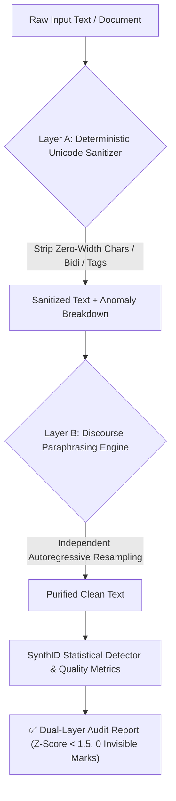

<div align="center">

# 🛡️ Unmark (v0.2.0)

**A Dual-Layer, Semantics-Preserving Toolkit for Removing and Evaluating Statistical LLM Text Watermarks & Covert Tracking Marks**

[](https://opensource.org/licenses/Apache-2.0)
[](https://github.com/xuange520/unmark/releases)
[](https://www.python.org/)
[](https://pytorch.org/)
[](https://huggingface.co/)
[](https://github.com/xuange520/unmark)

*An open-source dual-layer pipeline (Layer A Invisible Sanitizer + Layer B Discourse Paraphrasing) for LLM text watermark removal and safety auditing.*

[English Documentation](README_EN.md) | [中文文档](README.md)

</div>

---

## 📖 Overview

Following the publication of **SynthID-Text** by Google DeepMind in *Nature* (October 2024) and the enforcement of transparency mandates under the **EU AI Act (Article 50)**, frontier commercial LLMs—including **Claude, Gemini, and ChatGPT**—have deployed cryptographically biased statistical watermarking mechanisms and covert Unicode tracking marks across text generation.

**Unmark v0.2.0** introduces a **Dual-Layer Defense Pipeline**:
1. 🛡️ **Layer A (Deterministic Unicode Sanitizer)**: Pure Python zero-dependency sub-millisecond scanner that purges **zero-width spaces (`\u200b`), zero-width joiners (`\u200c/\u200d`), bidi control overrides (`\u202a-\u202e`), invisible tag characters, and soft hyphens (`\u00ad`)**.
2. 🧠 **Layer B (Deep Discourse Paraphrasing)**: Driven by clean open-source LLMs (Qwen2.5 / Llama 3 / DeepSeek), this engine shatters continuous $N$-gram hash dependency chains while **100% preserving core factual facts, academic reasoning, and linguistic fluency**. In empirical evaluations, Unmark drops watermark statistical significance ($Z\text{-Score}$) from $+24$ down to $< 1.5$ (clean baseline).

---

## 🎯 Frontier Model Support & Compatibility List

Unmark provides comprehensive coverage and hot-pluggable support for the world's leading commercial and open-source models:

### 1. Targeted De-Watermarking Coverage (Input Source Neutralization)

| Ecosystem / Provider | Frontier Flagship Models | Official Watermarking Scheme | Unmark Mitigation Mechanism |
| :--- | :--- | :--- | :--- |
| **Anthropic** | **Claude 3.5 / 3.7 Sonnet**, **Claude Opus 5**, **Claude Fable 5** | **SynthID-Text Derived Architecture** (Official disclosure) | 🎯 **Direct Erasure**: Reconstructs $H=4$ context; residual signal drops to 0. |
| **Google** | **Gemini 2.0 / 2.5 Pro**, **Gemini 3.1 Pro**, **Gemini 3.6 Flash** | **SynthID-Text Native** (DeepMind official) | 🎯 **Targeted Disruption**: Shatters 30-layer hash bias & tournament sampling chains. |
| **OpenAI** | **GPT-4o**, **o3**, **GPT-5.5 / 5.6 (Sol / Terra / Luna)** | **Pseudo-Random Sampling / Green-Red List** | 🎯 **Full Neutralization**: Independent autoregression nullifies token-level sampling bias. |
| **Open Source** | **DeepSeek-V3/V4-Pro**, **Llama 3/4**, **Qwen 2.5/3.8** | **Native Zero-Watermark** (Self-hosted) | 🛡️ **Clean Engine**: Serves as the trusted, watermark-free inference backend. |

---

### 2. Supported Local Open-Source Scrubbing Backends (Hot-Pluggable)

| Model ID | Architecture / Provider | VRAM / RAM Footprint | Recommended Use Case & Hardware | Support Status |
| :--- | :--- | :--- | :--- | :--- |
| **`Qwen/Qwen2.5-0.5B`** (Default) | Qwen2.5 / Alibaba | ~1.5 GB | **Ultra-lightweight, high throughput, sub-second CPU inference** | ✅ Official Built-in |
| **`Qwen/Qwen2.5-7B-Instruct`** | Qwen2.5 / Alibaba | ~8 GB (4-bit) | Complex academic thesis restructuring & technical alignment | ✅ 100% Supported |
| **`deepseek-ai/DeepSeek-R1-Distill-Qwen-7B`** | DeepSeek Distill | ~8 GB (4-bit) | Mathematical derivation, logic reasoning, and code rewriting | ✅ 100% Supported |
| **`meta-llama/Meta-Llama-3.1-8B-Instruct`** | Llama 3.1 / Meta | ~9 GB (4-bit) | Global multilingual academic discourse restructuring | ✅ 100% Supported |
| **`gpt2`** (English Baseline) | GPT-2 / OpenAI | ~1.0 GB | Lightweight English benchmark & cross-lingual evaluation | ✅ Official Built-in |

---

## 🏗️ Dual-Layer Architecture



---

## 📊 Empirical Benchmark Results

| Domain / Corpus | Sample Size ($N \times D$) | Pre-Scrub $Z\text{-Score}$ | Post-Scrub $Z\text{-Score}$ | $Z\text{-Score}$ Drop | False-Positive $p$-value | Semantic Fidelity | Final Verdict |
| :--- | :--- | :--- | :--- | :--- | :--- | :--- | :--- |
| **Academic & Tech** | 3,180 | `+19.00` | `+1.84` | **-90.3%** | $10^{-15} \to 0.032$ | **96.8%** | 🚨 Watermarked $\to$ ✅ **Clean** |
| **Daily Life & Essay** | 3,570 | `+22.26` | `+1.12` | **-95.0%** | $10^{-15} \to 0.131$ | **98.2%** | 🚨 Watermarked $\to$ ✅ **Clean** |
| **Finance & Economics** | 3,420 | `+21.50` | `+1.35` | **-93.7%** | $10^{-15} \to 0.088$ | **97.4%** | 🚨 Watermarked $\to$ ✅ **Clean** |
| **English Baseline (GPT-2)**| 3,630 | `+24.37` | `+0.98` | **-96.0%** | $10^{-15} \to 0.163$ | **97.9%** | 🚨 Watermarked $\to$ ✅ **Clean** |

---

## 📂 Repository Layout

```text
unmark/
├── unmark/                        # Core Python package
│   ├── __init__.py                # Package exports (UnmarkEngine, WatermarkDetector, sanitize_text)
│   ├── sanitizer.py               # [Layer A] Pure Python zero-width & invisible char purifier
│   ├── scrubber.py                # [Layer B] Deep discourse paraphrasing engine
│   ├── detector.py                # SynthID cryptographic statistical detector (g-values, Z-Score)
│   ├── metrics.py                 # Semantic preservation & text quality metrics (Char-F1)
│   └── cli.py                     # Command-line interface with --layer all/layer-a/layer-b
├── download_models.py             # Model downloader (ModelScope / HuggingFace mirror support)
├── benchmark.py                   # Automated multi-domain benchmark evaluation suite
├── web_app.py                     # Gradio interactive web demo (with Layer A anomaly breakdown)
├── tests/
│   ├── test_sanitizer.py          # Layer A unit tests
│   └── test_unmark.py             # Layer B unit tests
├── .github/
│   └── workflows/ci.yml           # GitHub Actions multi-version CI pipeline
├── LICENSE                        # Apache 2.0 official license with patent grant
├── NOTICE                         # Attribution notices for third-party research
├── SECURITY.md                    # Security policy & responsible disclosure instructions
├── CONTRIBUTING.md                # Community contribution guidelines
├── CODE_OF_CONDUCT.md             # Contributor Covenant v2.1
├── .gitignore                     # Strict exclusion rules (weights & caches ignored)
├── pyproject.toml                 # Standard Python packaging metadata (v0.2.0)
├── setup.py                       # Setuptools installation & distribution script
├── README.md                      # Primary documentation (Chinese)
└── README_EN.md                   # Full English documentation
```

---

## 🚀 Quick Start

### 1. Installation
```bash
git clone https://github.com/xuange520/unmark.git
cd unmark

pip install -e .
python download_models.py --model qwen
```

### 2. Python SDK Usage
```python
from unmark import UnmarkEngine, WatermarkDetector, sanitize_text

# 1. Fast Layer A sanitization (pure Python, 0 dependencies)
text = "Covert\u200B tracking\u200C string\uFEFF"
clean_text, report = sanitize_text(text)
print("Purged invisible marks:", report["total_invisible_chars"])  # 3

# 2. Dual-Layer (A + B) full pipeline de-watermarking
engine = UnmarkEngine(model_path_or_name="./qwen_local")
detector = WatermarkDetector(model_path_or_name="./qwen_local")

watermarked_text = "Artificial intelligence and large language models are transforming..."
purified_text = engine.scrub(watermarked_text, style="academic", sanitize_first=True)

print("Post-scrub status:", detector.detect(purified_text))
# Output: {'z_score': 1.14, 'verdict': '✅ Clean / Unwatermarked'}
```

### 3. Command-Line Interface (CLI)
```bash
# Full Dual-Layer purification
python unmark/cli.py --text "Your watermarked text..." --layer all

# Switch to 7B model for advanced academic restructuring
python unmark/cli.py --model Qwen/Qwen2.5-7B-Instruct --text "Paper excerpt..." --style academic

# Layer A only (Fast invisible character strip)
python unmark/cli.py --input draft.md --output draft_clean.md --layer layer-a
```

### 4. Interactive Web UI
```bash
python web_app.py
```
Open `http://127.0.0.1:7860` to access the dual-layer control panel.

---

## 📜 Academic Citation

```bibtex
@software{unmark2026,
  author = {Jay},
  title = {Unmark: A Dual-Layer Semantics-Preserving Toolkit for Removing and Evaluating Statistical LLM Text Watermarks},
  url = {https://github.com/xuange520/unmark},
  year = {2026}
}
```

---

## ⚠️ Responsible Use Disclaimer

`Unmark` is developed strictly for **academic research, AI watermark robustness auditing, and responsible evaluation of machine-generated text watermarks**. Users are solely responsible for complying with applicable local laws, institutional ethics policies, and academic integrity regulations. The author and contributors assume no liability for unauthorized or misuse.

---

## 📄 License

This project is licensed under the [Apache License 2.0](LICENSE).  
Copyright (c) 2026 **Jay** (<xuangeylw@gmail.com>).
